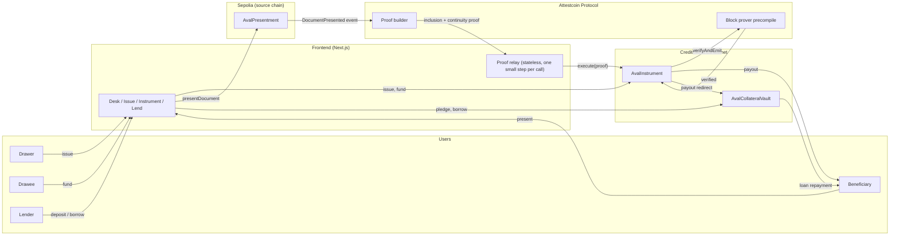
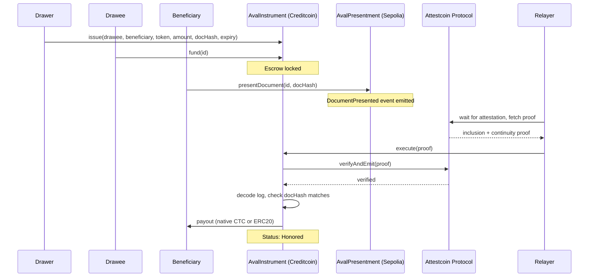

# Aval

Aval is a documentary credit built on Creditcoin. A buyer's payment sits in escrow until proof
that goods actually shipped arrives from another chain, verified without a bank, a custodial
oracle, or a bridge operator in the loop.

Built for BUIDL CTC 2026 Fall (Creditcoin x Credit Labs), RWA track.

Live app: **https://aval-three-phi.vercel.app**
Pitch deck: [`docs/aval-pitch-deck.pdf`](docs/aval-pitch-deck.pdf)

Live on testnet:

- `AvalInstrument`: [`0xFbe8A52580E0155dB0154eaeFc6D66c91565F5DE`](https://creditcoin-testnet.blockscout.com/address/0xFbe8A52580E0155dB0154eaeFc6D66c91565F5DE) on Creditcoin CC3 testnet
- `AvalCollateralVault`: [`0x1584A2252694E957e8B569d6F55A1C856aEa4a94`](https://creditcoin-testnet.blockscout.com/address/0x1584A2252694E957e8B569d6F55A1C856aEa4a94) on Creditcoin CC3 testnet
- `AvalPresentment`: [`0x2017c0D852b949a5835D99f86CDb6FA9c0eCf141`](https://sepolia.etherscan.io/address/0x2017c0D852b949a5835D99f86CDb6FA9c0eCf141) on Sepolia
- `AvalTestToken` (aTUSD, a mock stablecoin for demoing ERC20 settlement): [`0xff726e92187002ef2615b80FbE67c79b9DF6a2ec`](https://creditcoin-testnet.blockscout.com/address/0xff726e92187002ef2615b80FbE67c79b9DF6a2ec) on Creditcoin CC3 testnet

All three Creditcoin contracts are verified on the explorer, source, ABI, and a Read/Write tab
included, anyone can inspect them or call them directly, no need to trust the frontend. aTUSD
mints freely (`mint(address,uint256)`, no restriction), so testing the ERC20 path doesn't need
anything from us: mint yourself some from the app itself, or straight from the explorer.

## The problem

A documentary credit (a letter of credit, in older language) is how most of the world's trade
gets paid for. An importer's bank promises to pay an exporter once the exporter proves, on paper,
that goods were shipped. It works, but it is slow: banks on both sides manually check paper
documents against the credit terms, and the process routinely takes days to weeks and costs real
money in bank fees. It also depends entirely on trusting both banks to do their job honestly.

## What Aval does instead

1. A drawer (the exporter) issues an instrument on Creditcoin: an amount, a drawee (the
   importer), a beneficiary to be paid, and the hash of the document that has to be presented.
2. The drawee funds the instrument, in native CTC or an ERC20 (a stablecoin, in practice). The
   amount is locked in the contract, not held by a bank.
3. When the goods ship, the beneficiary presents that document on a source chain (Sepolia in
   this build, any EVM chain the Attestcoin Protocol supports in principle).
4. The Attestcoin Protocol proves that presentation happened, and Aval's contract on Creditcoin
   verifies that proof directly against the real block prover precompile, checks the document
   hash matches, and releases the funds. No party decides this by hand.

If the document never gets presented before the deadline, the drawee gets the escrow back
automatically.

## Architecture

Four pieces, two chains, no piece in the middle that has to be trusted:



`AvalInstrument` never asks Attestcoin's off-chain services to be trusted, only the precompile,
which is part of Creditcoin itself. Everything upstream of that (the proof builder, the relay) is
just plumbing to get a proof in front of the contract; none of it can make the contract accept a
proof that isn't real.

The relay itself deliberately holds no state on the server between calls. Each call does one
small, bounded check (is it mined yet, is it attested yet, is the proof cached yet) and hands
back exactly what's needed to resume. The browser drives the polling and keeps the running log,
so a page reload mid-wait doesn't lose progress, and no single request has to survive the several
minutes the full wait can take, which matters on serverless hosting.

The proof lifecycle, in order:



`Relayer` is just whoever pays the Creditcoin gas to submit the proof, the frontend's own wallet
by default, so the beneficiary never needs testnet CTC of their own. `execute()` is permissionless:
anyone submitting the same valid proof gets the same result, the relayer has no special power.

## Instrument financing

A beneficiary does not have to wait out the full presentment window to get paid. Once an
instrument is funded, they can borrow up to 80% of its value from AvalCollateralVault, a small
lending pool. The loan is repaid automatically, out of the instrument's own payout, the moment
Attestcoin proves the document presentation. There is no separate repayment step and no way for
the borrower to skip it, because the money never passes through their hands until the loan is
already settled.

## How the trust actually works

Aval does not build its own cross-chain verification. It uses Creditcoin's Attestcoin Protocol
(`@gluwa/asc-contracts` and `@gluwa/usc-sdk`), the same base contracts and off-chain proof
pipeline used in Gluwa's own reference examples. `AvalInstrument` extends `ASCBase`, which checks
every submitted proof against the real block prover precompile before any of Aval's own logic
runs. Aval decides what a valid document presentation means for its own instruments; it does not
decide what counts as a valid inclusion proof. That part stays exactly as audited.

## Repository layout

```
contracts/   Solidity contracts, Foundry tests, and the TypeScript deployment/demo scripts
web/         Frontend
docs/        Technical write-up, pitch deck (outline and PDF), testing guide
```

## Contracts

- `AvalInstrument.sol`, deployed on Creditcoin. Issues, funds, and honors instruments. Verifies
  Attestcoin proofs itself through `ASCBase.execute()`.
- `AvalPresentment.sol`, deployed on the source chain. The one contract Aval trusts for document
  presentation events.
- `AvalCollateralVault.sol`, deployed on Creditcoin. The instrument financing pool described
  above. Native CTC instruments only, for now: it's notified of a payout with a value-carrying
  call, which doesn't make sense for an ERC20.
- `AvalTestToken.sol`, deployed on Creditcoin. A mock stablecoin (aTUSD, 6 decimals, mints
  freely) for demoing an instrument settled in an ERC20 instead of native CTC.

Run the test suite:

```bash
cd contracts
npm install
npm run build
npm test
```

## Running the full flow on testnet

See `contracts/.env.example` for the environment variables you need (a funded wallet on both
Sepolia and Creditcoin CC3 testnet, RPC URLs, and the Attestcoin proof builder URL).

```bash
cd contracts
npm run deploy:sepolia       # deploys AvalPresentment
npm run deploy:creditcoin    # deploys AvalInstrument and AvalCollateralVault
npm run register:source      # tells AvalInstrument which source contract to trust

npm run issue -- <drawee> <beneficiary> <amountEth> "<document text>" <expiryBlocksFromNow>
npm run fund -- <instrumentId>
npm run present -- <instrumentId> "<document text>"
npm run verify-proof -- <instrumentId> <sepoliaTxHash>   # the Attestcoin step
npm run status -- <instrumentId>
```

To run it as two separate wallets instead of one (so it isn't just talking to itself), set
`COUNTERPARTY_PRIVATE_KEY` in `.env`, issue with the counterparty's address as drawee and
beneficiary, then add `--as counterparty` to `fund` and `present`:

```bash
npm run fund -- <instrumentId> --as counterparty
npm run present -- <instrumentId> "<document text>" --as counterparty
```

`verify-proof` stays as the first wallet: `execute()` is permissionless, so it's just paying the
Creditcoin gas to relay a proof, not acting as a party to the trade.

To settle in aTUSD instead of native CTC, deploy the token, mint some, and pass `test` as a sixth
argument to `issue` (amounts are then read as the token's own 6-decimal units, e.g. `10000000` is
10.00 aTUSD):

```bash
npm run deploy:test-token
npm run mint:test-token -- <to> <amount>
npm run issue -- <drawee> <beneficiary> <amount> "<document text>" <expiryBlocksFromNow> test
```

## Status

Live on testnet and deployed at https://aval-three-phi.vercel.app. The full flow has been run end
to end for real, more than once: single-wallet, two separate wallets settling in native CTC, and
two separate wallets settling in the ERC20 test stablecoin. All honored correctly. The frontend
(Desk, Issue, instrument detail with fund/present/verify, and the lending pool) is live and wired
to the deployed contracts, all three Creditcoin contracts are verified on the block explorer.

A round of real user testing on the live deployment also turned up two genuine reliability bugs,
both fixed and re-verified against production, not just locally: the proof relay used to lose
track of progress across serverless invocations (fixed by making it fully stateless), and an
instrument could fail with a bare revert if attestation crossed its expiry window mid-wait (fixed
by checking the real block number before every step, with a clear reason instead of a raw
revert). See `PROGRESS.md` for the day-by-day log.

## License

MIT
